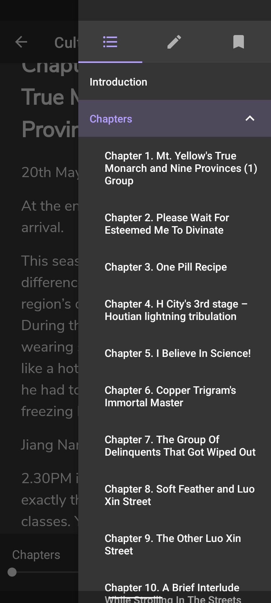
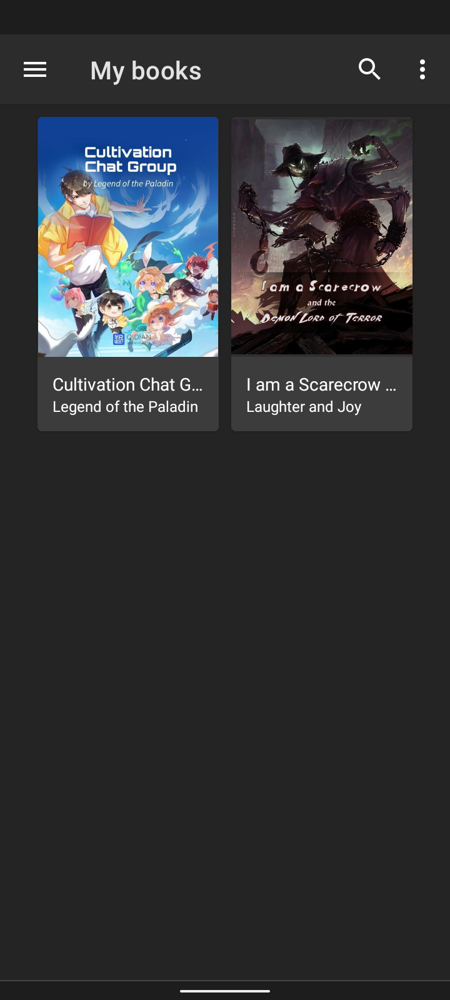

# Ranobes Scrapper

This Python script scrapes novels from [Ranobes](https://ranobes.net/) and saves them into .epub format with an optional conversion into .pdf format

### Features

- Regular updates
- No 'In preparation, Keguan...' for chapters
- 10,000+ novels to scrape
- Terminal based and simple to use
- Scraping progress can be monitored

### Getting Started

Install the latest version of [Python](https://www.python.org/). It may work with older versions but has not been tested.

### Prerequisites

This script depends on bs4, ebooklib, progress and pdfkit. To install these navigate to the project folder and run

```
pip install -r requirements.txt
```

### Usage

Navigate to the project folder and run

```
python main.py
```
to start the script

Now copy and paste the URL of the novel you wish to scrape from [Ranobes](https://ranobes.net/).


It will start extracting the chapter list.


After that, select the chapter range and it will start scraping the chapters.


Now save the file. The file gets saved in .epub format


After saving the file, you will get a prompt for the conversion of .epub to .pdf format.


Choose accordingly and enjoy your read.

### Lithium: EPUB Reader

Personally, I prefer the [Lithium: EPUB Reader](https://play.google.com/store/apps/details?id=com.faultexception.reader) due to its simplicity and ease of use to read .epub files.

<table>
    <tr>
        <td></td>
        <td></td>
        <td></td>
        <td></td>
    </tr>
</table>

### Finally

Feel free to open an issue if you face any bugs or have any suggestions.
